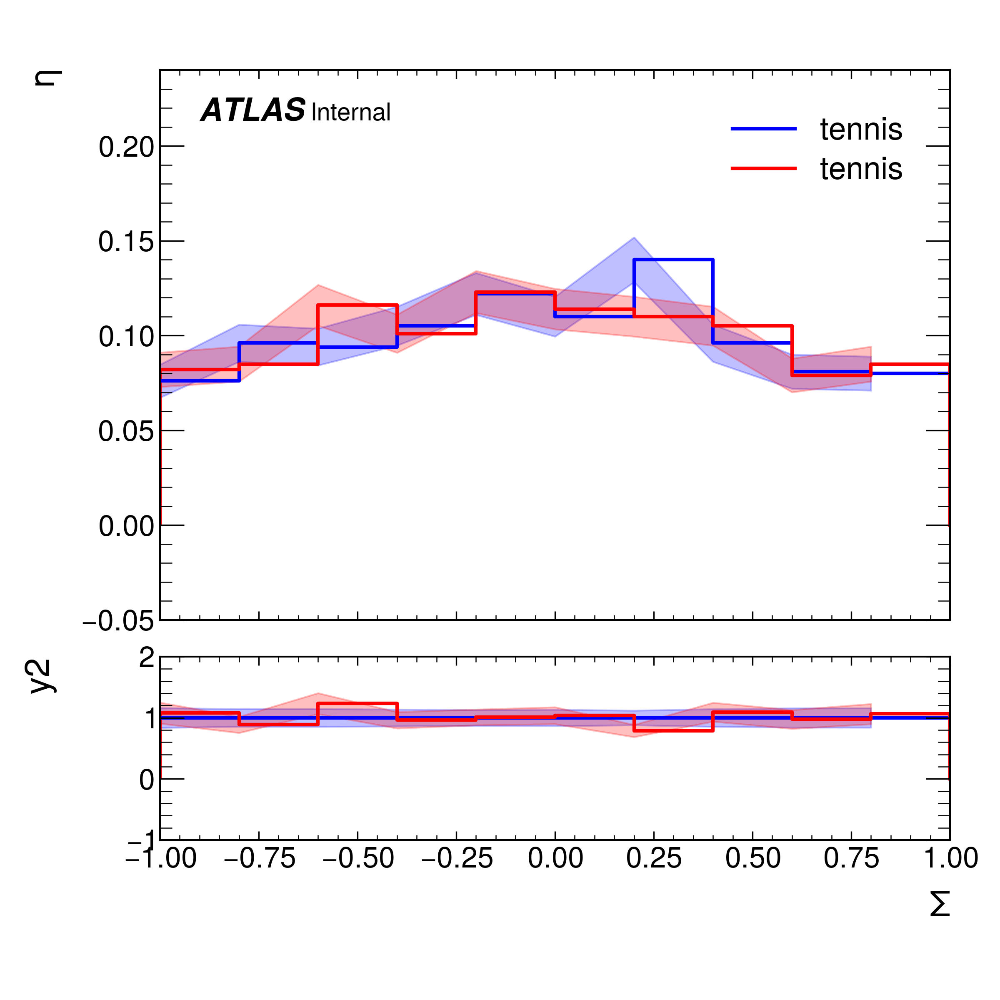

# Py3.6

This is the current nominal method for plotting histograms in my local ROOT and python set up

## Requirements:
Use `python3.6` to run.

Uses ROOT 24.06 

## Running
To see a full example, see the associated notebook.

To construct a ratio plot for example, one initialises the `Ratio_Plot_ROOT` object, passing my pythonic-histogram wrappers

```python3
p = Ratio_Plot_ROOT("A Plot",list_of_histograms=[x1,x2],divisor=x1,normalise=True)
```

The `Make_Ratio_Plot` method generates the plot based on the data and meta-data of the pythonic-histogram wrappers. The plot style can be selected as an input. The outputs can then be manipulated as one sees fit.
```python3
plt,ax,rax = p.Make_Ratio_Plot("errorbar-line")

```




